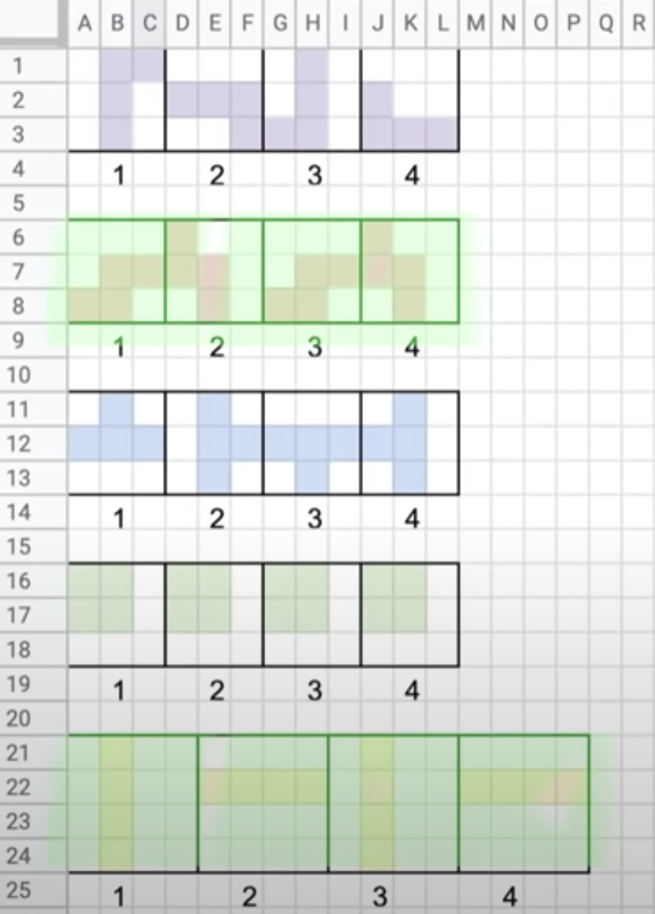

# 2D Tetris game  

A reenvisioned version of Alexey Pajitnov's orignal Tetris game.
Tetris has been released for virtually every computer and electronic gaming system, and it is often revered as a classic. Though numerous sequels have been spawned.

Tetris games almost always have the same play mechanics: differently shaped blocks drop at varying speeds, and, as the blocks descend, the player must rotate and arrange them to create an uninterrupted horizontal row on the screen. When the player forms one or more solid rows, the completed rows disappear. The goal of the game is to prevent the blocks from stacking up to the top of the screen for as long as possible.  

## Development ##  

UI written in HTML and can be viewed in any automated browser. Model written in **Java Script**.

## Setup ##

No dependencies needed to add in order to play the game. Before starting the game open `index.htm` file in the browser or using live server.
<br />

## Tetrominoes ##

<p align="center">
    <br />
    *Tetrominoes*
</p>

## Usage ##
Run the game by opening `index.html`.

## Controls ##  

```
"up key" - Move Left
"right key" - Move Right
"move up" - Rotate Left
"move down" - Hard drop
```
